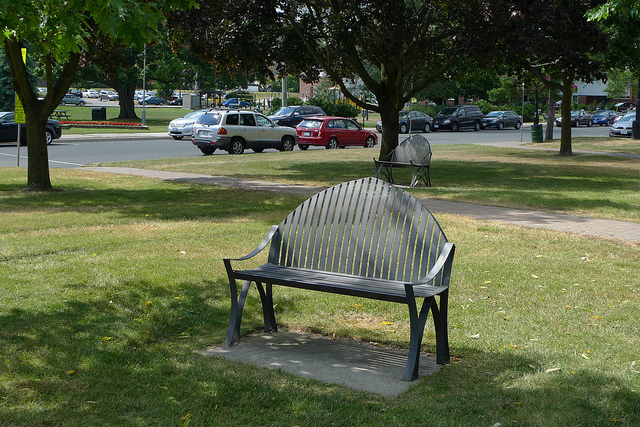
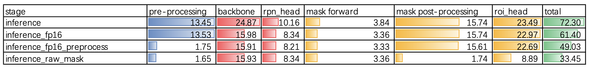
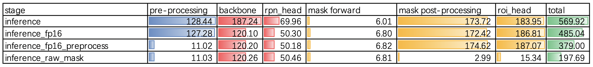
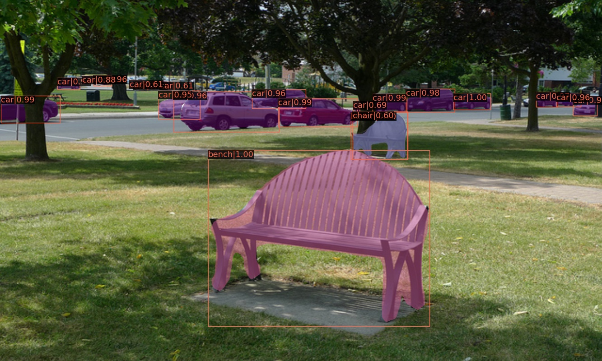
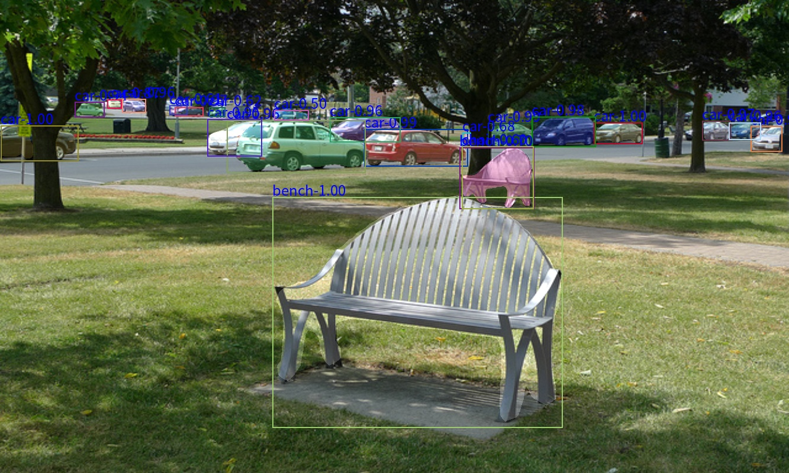

# mmdet_benchmark

本项目是为了研究 mmdet 推断性能瓶颈，并且对其进行优化。

# 配置与环境

## 机器配置

```
CPU：Intel(R) Core(TM) i9-10900K CPU @ 3.70GHz
GPU：NVIDIA GeForce RTX 3080 10GB
内存：64G
硬盘：1TB NVME SSD
```

## mmdet 环境

```
Python: 3.9.7 (default, Sep 16 2021, 13:09:58) [GCC 7.5.0]
CUDA available: True
GPU 0: NVIDIA GeForce RTX 3080
CUDA_HOME: /usr/local/cuda
NVCC: Build cuda_10.2_r440.TC440_70.29663091_0
GCC: gcc (Ubuntu 7.5.0-3ubuntu1~18.04) 7.5.0
PyTorch: 1.9.1+cu111
PyTorch compiling details: PyTorch built with:
  - GCC 7.3
  - C++ Version: 201402
  - Intel(R) Math Kernel Library Version 2020.0.0 Product Build 20191122 for Intel(R) 64 architecture applications
  - Intel(R) MKL-DNN v2.1.2 (Git Hash 98be7e8afa711dc9b66c8ff3504129cb82013cdb)
  - OpenMP 201511 (a.k.a. OpenMP 4.5)
  - NNPACK is enabled
  - CPU capability usage: AVX2
  - CUDA Runtime 11.1
  - NVCC architecture flags: -gencode;arch=compute_37,code=sm_37;-gencode;arch=compute_50,code=sm_50;-gencode;arch=compute_60,code=sm_60;-gencode;arch=compute_70,code=sm_70;-gencode;arch=compute_75,code=sm_75;-gencode;arch=compute_80,code=sm_80;-gencode;arch=compute_86,code=sm_86
  - CuDNN 8.0.5
  - Magma 2.5.2
  - Build settings: BLAS_INFO=mkl, BUILD_TYPE=Release, CUDA_VERSION=11.1, CUDNN_VERSION=8.0.5, CXX_COMPILER=/opt/rh/devtoolset-7/root/usr/bin/c++, CXX_FLAGS= -Wno-deprecated -fvisibility-inlines-hidden -DUSE_PTHREADPOOL -fopenmp -DNDEBUG -DUSE_KINETO -DUSE_FBGEMM -DUSE_QNNPACK -DUSE_PYTORCH_QNNPACK -DUSE_XNNPACK -DSYMBOLICATE_MOBILE_DEBUG_HANDLE -O2 -fPIC -Wno-narrowing -Wall -Wextra -Werror=return-type -Wno-missing-field-initializers -Wno-type-limits -Wno-array-bounds -Wno-unknown-pragmas -Wno-sign-compare -Wno-unused-parameter -Wno-unused-variable -Wno-unused-function -Wno-unused-result -Wno-unused-local-typedefs -Wno-strict-overflow -Wno-strict-aliasing -Wno-error=deprecated-declarations -Wno-stringop-overflow -Wno-psabi -Wno-error=pedantic -Wno-error=redundant-decls -Wno-error=old-style-cast -fdiagnostics-color=always -faligned-new -Wno-unused-but-set-variable -Wno-maybe-uninitialized -fno-math-errno -fno-trapping-math -Werror=format -Wno-stringop-overflow, LAPACK_INFO=mkl, PERF_WITH_AVX=1, PERF_WITH_AVX2=1, PERF_WITH_AVX512=1, TORCH_VERSION=1.9.1, USE_CUDA=ON, USE_CUDNN=ON, USE_EXCEPTION_PTR=1, USE_GFLAGS=OFF, USE_GLOG=OFF, USE_MKL=ON, USE_MKLDNN=ON, USE_MPI=OFF, USE_NCCL=ON, USE_NNPACK=ON, USE_OPENMP=ON,

TorchVision: 0.10.1+cu111
OpenCV: 4.5.4
MMCV: 1.3.17
MMCV Compiler: GCC 7.3
MMCV CUDA Compiler: 11.1
MMDetection: 2.19.0+
```

# 时间分析

Mask R-CNN 的推断过程包含以下几个步骤，我们在一些可能是瓶颈的位置增加了时间统计：

* 图像预处理，`pre-processing`，[mmdet/apis/inference.py#L104-L150](mmdet/apis/inference.py#L104-L150)
* ResNet50 提取特征，`backbone`，[mmdet/models/detectors/two_stage.py#L181-L185](mmdet/models/detectors/two_stage.py#L181-L185)
* RPN 提取候选框，`rpn_head`，[mmdet/models/detectors/two_stage.py#L187-L194](mmdet/models/detectors/two_stage.py#L187-L194)
* ROI 精调框以及输出 mask，`roi_head`，[mmdet/models/detectors/two_stage.py#L196-L201](mmdet/models/detectors/two_stage.py#L196-L201)
    * `bbox forward`，时间太短未统计，5ms 以内
    * `bbox post-processing`，时间太短未统计，5ms 以内
    * `mask forward`，[mmdet/models/roi_heads/test_mixins.py#L253-L272](mmdet/models/roi_heads/test_mixins.py#L253-L272)
    * `mask post-processing`，[mmdet/models/roi_heads/test_mixins.py#L275-L288](mmdet/models/roi_heads/test_mixins.py#L275-L288)

注意：`mask post-processing` 的时间包含在 `roi_head` 里，所以缩小 `mask post-processing` 的时间就是在缩小 `roi_head` 的时间。

## 1333x800

使用标准的 1333x800 尺寸测试。

测试图片：



| stage                     | pre-processing | backbone | rpn_head | mask forward | mask post-processing | roi_head | total |
|---------------------------|----------------|----------|----------|--------------|----------------------|----------|-------|
| inference                 | 13.45          | 24.87    | 10.16    | 3.84         | 15.74                | 23.49    | 72.3  |
| inference_fp16            | 13.53          | 15.98    | 8.34     | 3.36         | 15.74                | 22.97    | 61.4  |
| inference_fp16_preprocess | 1.75           | 15.91    | 8.21     | 3.33         | 15.61                | 22.69    | 49.03 |
| inference_raw_mask        | 1.65           | 15.93    | 8.34     | 3.36         | 1.74                 | 8.89     | 33.45 |



## 3840x2304

使用较大的尺寸进行测试：

| stage                     | pre-processing | backbone | rpn_head | mask forward | mask post-processing | roi_head | total   |
|---------------------------|----------------|----------|----------|--------------|----------------------|----------|---------|
| inference                 | 128.44         | 187.24   | 69.96    | 6.01         | 173.72               | 183.95   | 569.92  |
| inference_fp16            | 127.28         | 120.10   | 50.30    | 6.80         | 172.42               | 186.81   | 485.04  |
| inference_fp16_preprocess | 11.02          | 120.20   | 50.18    | 6.82         | 174.62               | 187.07   | 379.00  |
| inference_raw_mask        | 11.03          | 120.26   | 50.46    | 6.81         | 2.99                 | 15.34    | 197.69  |



# 可视化

mmdet 原版：



加速版：



目测没有显著差异。

# 总结

* 使用 `wrap_fp16_model` 可以节省 `backbone` 的时间，但是不是所有情况下的 `forward` 都能节省时间；
* 使用 `torchvision.transforms.functional` 去做图像预处理，可以极大提升推断速度；
* 使用 `FCNMaskHeadWithRawMask`，避免对 `mask` 进行 `resize`，对越大的图像加速比越高，因为 `resize` 到原图大小的成本很高；
* 后续优化，需要考虑 `backbone` 和 `rpn_head` 的优化，可以使用 `TensorRT` 进行加速。
